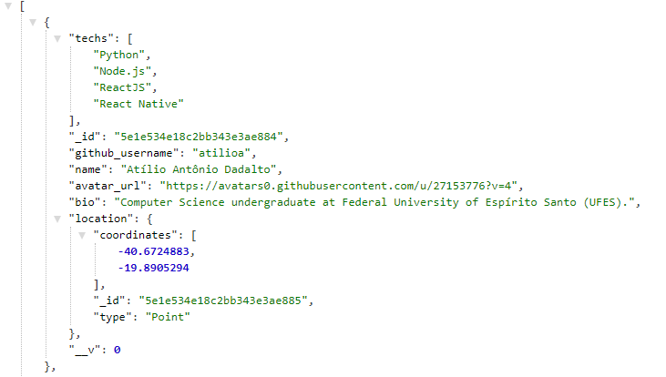
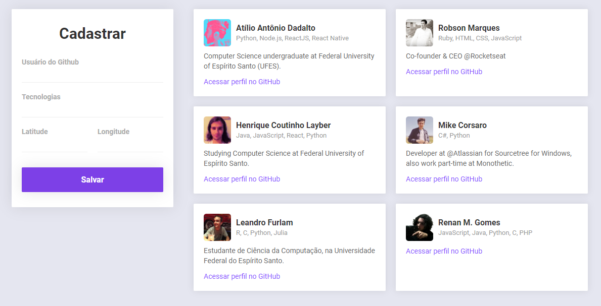
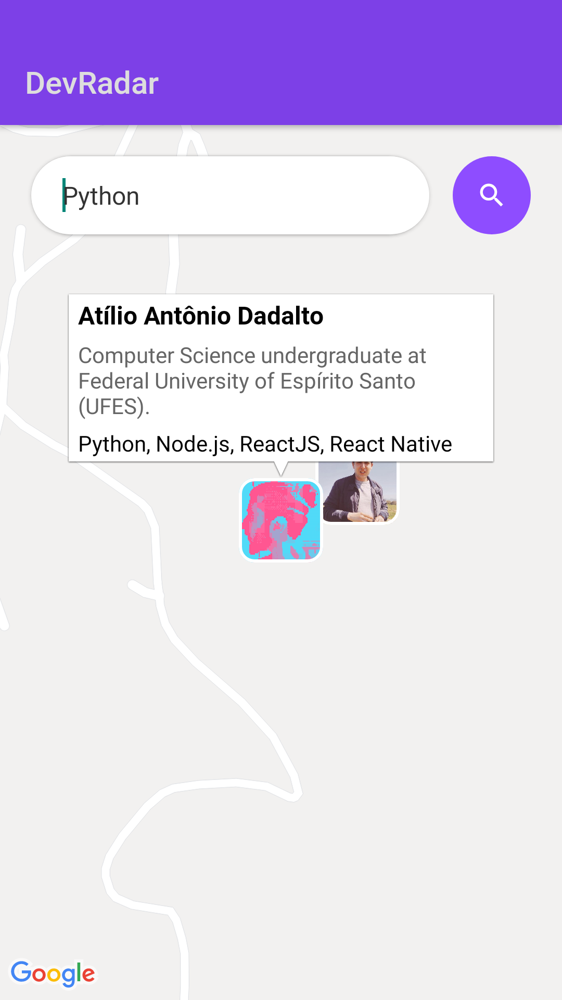
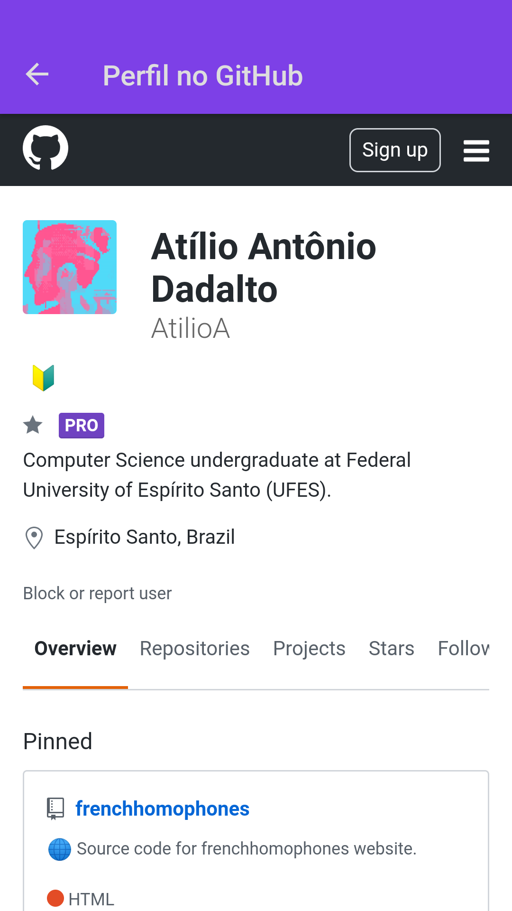

<h1 align="center">
    
</h1>

  <a href="#💻-projeto">Projeto</a>&nbsp;&nbsp;&nbsp;|&nbsp;&nbsp;&nbsp;
  <a href="#🔧-tecnologias">Tecnologias</a>&nbsp;&nbsp;&nbsp;|&nbsp;&nbsp;&nbsp;
  <a href="#⚙️-backend">Backend</a>&nbsp;&nbsp;&nbsp;|&nbsp;&nbsp;&nbsp;
  <a href="#📺-frontend">Frontend</a>&nbsp;&nbsp;&nbsp;|&nbsp;&nbsp;&nbsp;
  <a href="#📱-mobile">Mobile</a>&nbsp;&nbsp;&nbsp;|&nbsp;&nbsp;&nbsp;
  <a href="#🏠-rodando-localmente">Rodando localmente</a>

  

 

# 💻 Projeto

O DevRadar é um projeto desenvolvido durante a 10ª Semana Omnistack que visa conectar desenvolvedores próximos a você e que possuem experiência com as tecnologias buscadas.

## 🔧 Tecnologias

Esse projeto foi desenvolvido com as seguintes tecnologias:

- [Node.js](https://nodejs.org/en/)
- [React](https://reactjs.org)
- [React Native](https://facebook.github.io/react-native/)
- [Expo](https://expo.io/)

## ⚙️ Backend

API feita com Express que manipula usuários do GitHub, suas tecnologias e coordenadas para popular um banco de dados MongoDB.

Exemplo de saída de listagem de usuários da API:

  

## 📺 Frontend

Página criada com React alimentado da API do backend; possui um formulário cadastro de devs e listagem de devs cadastrados ao lado direito.

Exemplo de tela inicial do front-end:

  

## 📱 Mobile

Aplicação mobile que mostra um mapa com possibilidade de pesquisa de devs pertos de você, por tecnologia.

Exemplo de tela principal e de navegador em perfil do GitHub:

  
  

# 🏠 Rodando localmente

1. Clone o repositório;

### Backend

2. Acesse a pasta `backend` e execute `yarn` para instalar as dependências do backend;

3. Abra o arquivo `.env.example` e renomeie-o para `.env`;

4. Mude a variável `MONGODB_URI` pela string de conexão do seu banco de dados MongoDB. Você pode [criar uma conta gratuita](https://www.mongodb.com/cloud) para utilizar o MongoDB e obter seu próprio URI de conexão;

5. Execute `yarn dev` para inicializar o backend.

Agora o servidor estará funcionando.

### Frontend

5. Acesse a pasta `web` e execute `yarn` para instalar as dependências do frontend;

6. Execute `yarn start` para inicializar a aplicação React.

Sua aplicação React irá servir a porta http://localhost:3000 (porta do frontend) e será feito uma request para sua API através do endereço http://localhost:2832 (porta do backend). Note que o backend deve estar rodando para que você possa utilizar o frontend.

### Mobile

7. Acesse a pasta `mobile` e execute `yarn` para instalar as dependências do projeto mobile;

8. Execute `yarn start` para inicializar a aplicação com Expo. Mais uma vez, backend deve estar rodando para que você possa utilizar a aplicação corretamente;

   - Se você estiver usando um emulador em seu computador, clique no botão "Run on Android device/emulator";

   - Se você estiver usando seu celular, instale o aplicativo Expo e use-o para ler o QR Code exibido no terminal ou na página aberta ao rodar o comando `yarn start`.
